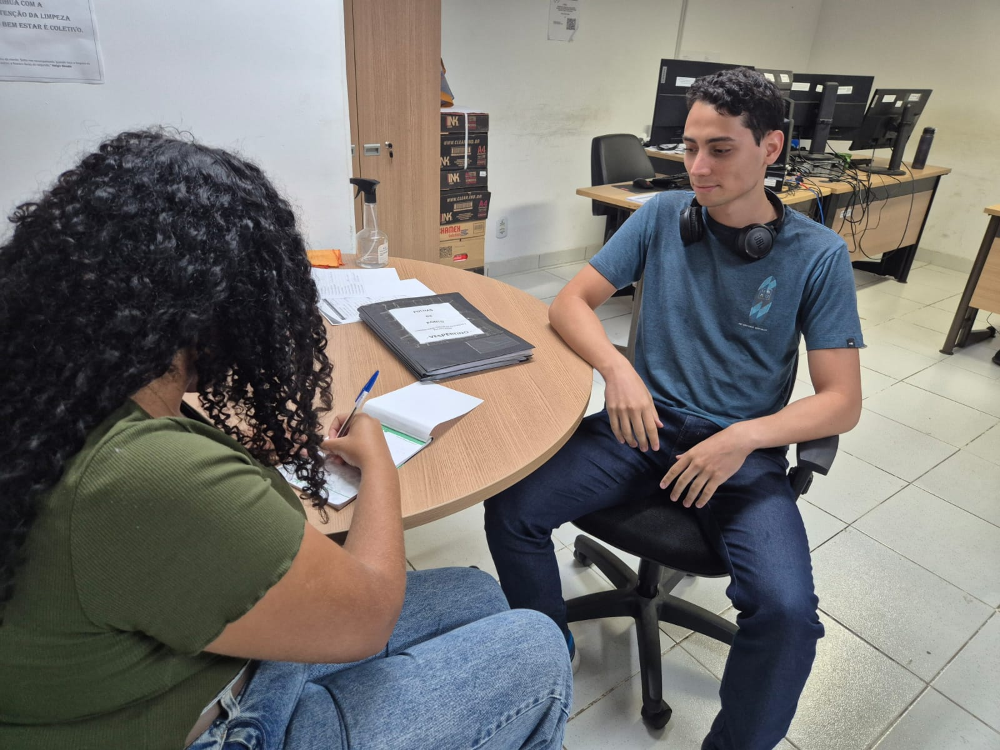
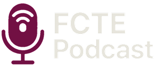
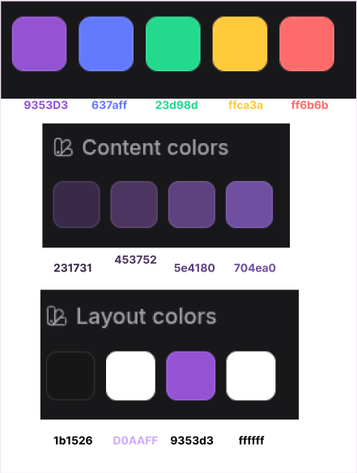
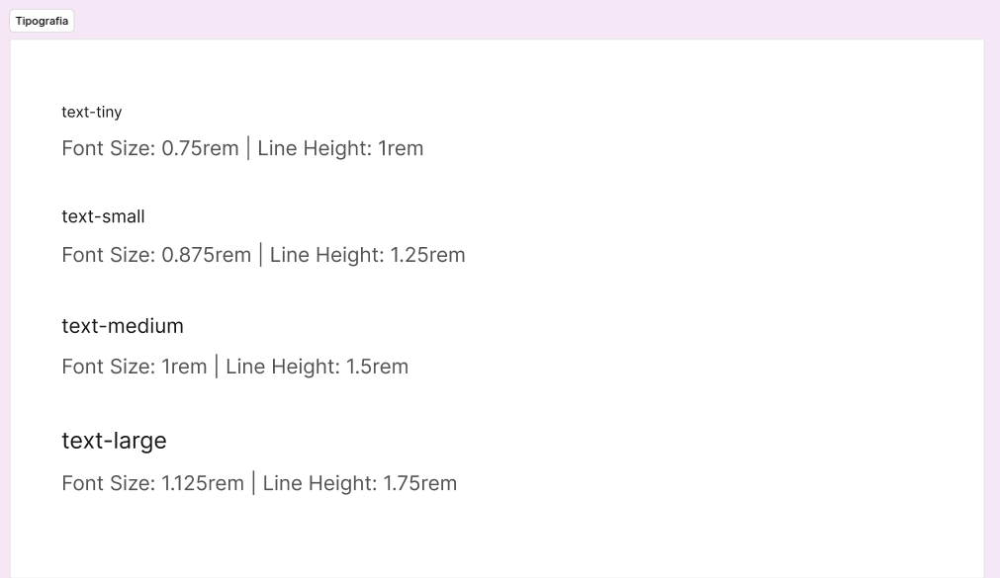
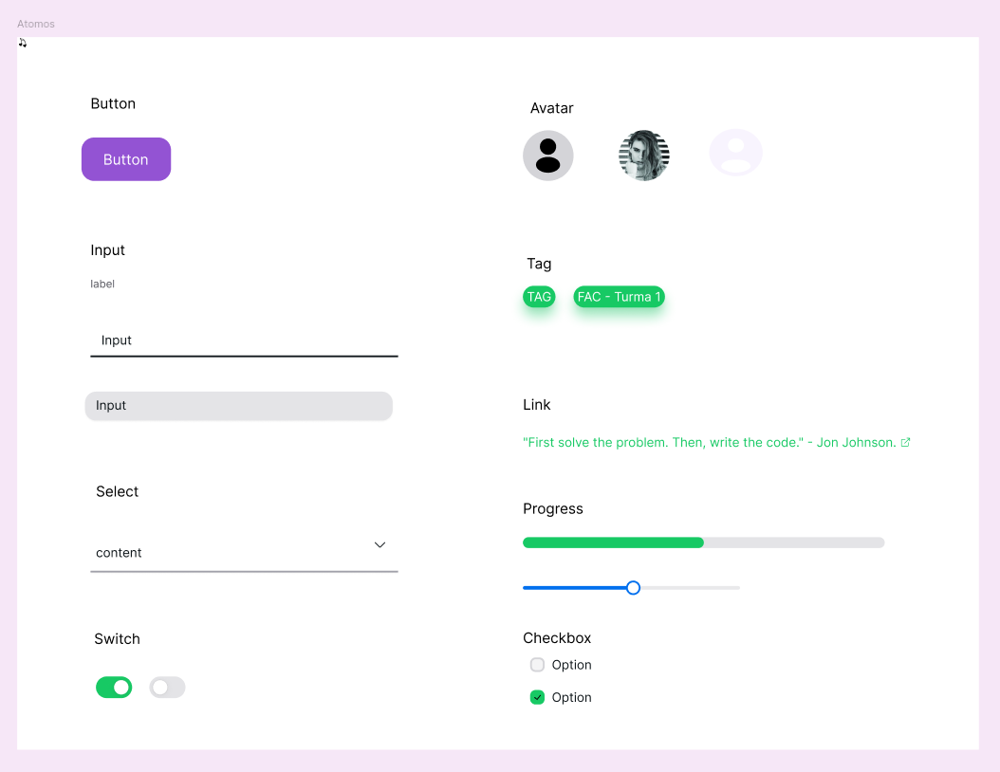
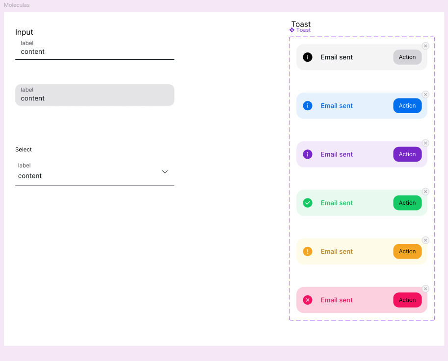
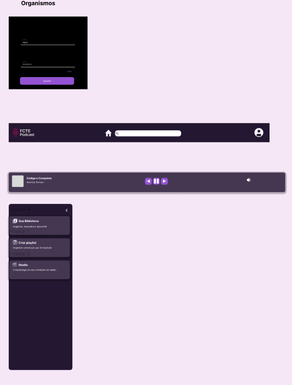
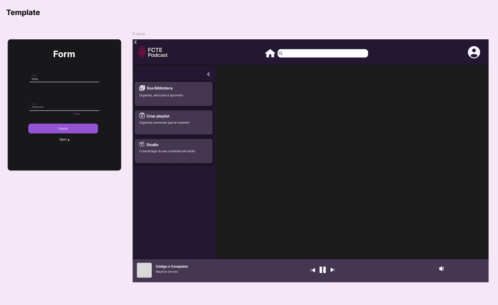
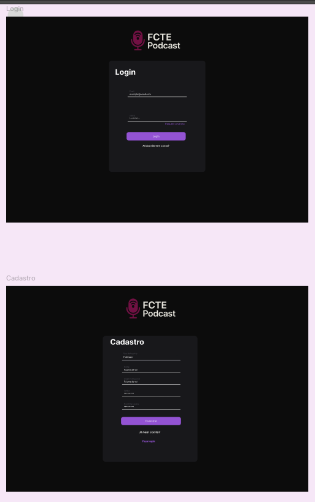
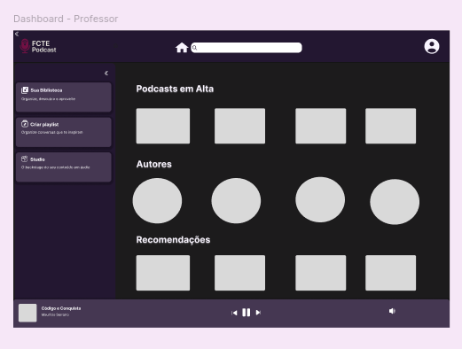

# 🎨 1.1. Módulo Design Sprint

## 🧩 Unpack — "Entrevistas"

Foram realizadas entrevistas presenciais com alguns alunos e professores da FCTE. Optamos por não utilizar formulários, pois consideramos que poderiam limitar as respostas dos entrevistados.
Após as entrevistas, reunimos as principais reclamações e sugestões apresentadas, com o objetivo de compreender melhor as necessidades do público e definir com mais clareza o perfil dos usuários para os quais nosso produto será desenvolvido.

---

## 💡 Brainstorm

Com base nas informações obtidas durante as entrevistas, iniciamos a fase de brainstorming. Nesse momento, reunimos as principais ideias, sugestões e problemas identificados, buscando soluções que melhor atendessem às necessidades levantadas e resolvessem de forma eficaz os desafios apresentados.

<iframe width="768" height="432" src="https://miro.com/app/live-embed/uXjVID3_SBU=/?moveToViewport=9780,-2053,3009,1395&embedId=78010507107" frameborder="0" scrolling="no" allow="fullscreen; clipboard-read; clipboard-write" allowfullscreen></iframe>

---

## ✏️ Sketch

Após o brainstorm a equipe partiu para a elaboração das ideias, focando no indivíduo em cada escopo da aplicação. A partir desse processo, foram desenvolvidos dois Rich Pictures: o primeiro representando ideias mais iniciais e conceituais, e o segundo contendo propostas mais refinadas e definidas. 

<iframe width="768" height="432" src="https://miro.com/app/live-embed/uXjVID3_SBU=/?moveToViewport=-1710,2028,10240,5296&embedId=200146767680" frameborder="0" scrolling="no" allow="fullscreen; clipboard-read; clipboard-write" allowfullscreen></iframe>

---

## 🧠 Decision

Depois das discussões sentimos que tínhamos um conhecimento adequado do domínio, assim fomos decidindo quais eram as melhores ideias, cortando de acordo com os seguintes critérios:

* ⏳ Limitação de tempo (Semestre)  
* 🛠️ Limitação técnica (Conhecimento)  
* 💭 Ideias não tão boas  

---

### 🖼️ RichPicture Final

<iframe width="768" height="432" src="https://miro.com/app/live-embed/uXjVID3_SBU=/?moveToViewport=3709,2583,7680,3972&embedId=830977758735" frameborder="0" scrolling="no" allow="fullscreen; clipboard-read; clipboard-write" allowfullscreen></iframe>

---

### 🧠 Brainstorm Final

<iframe width="768" height="432" src="https://miro.com/app/live-embed/uXjVID3_SBU=/?moveToViewport=-1399,-805,2486,1286&embedId=423356841510" frameborder="0" scrolling="no" allow="fullscreen; clipboard-read; clipboard-write" allowfullscreen></iframe>

---

## 🧪 Prototype

E assim, finalmente, partimos para a prototipagem. Aqui nós focamos na praticidade e acessibilidade, também achamos interessante aplicar o Atomic Design no nosso Projeto, já na fase inicial, assim, começamos a fazer o design dos componentes mais básicos (Átomos) e assim os combinando para formar a nossa interface.

Aqui também fizemos nossa identidade visual.

---

### 🖌️ Logo

---

### 🎨 Paleta de cores

---

Também definimos alguns aspectos de identidade da própria marca.

* 🌐 **Domínio**  
  fctepodcast.site

* 📧 **Emails de contato**  
  suporte@fctepodcast.site  
  contato@fctepodcast.site

## 🎨 Protótipos Figma

Aqui nós definimos os **padrões visuais mais "técnicos"** que deverão ser seguidos durante todo o projeto.

### 🔤 Tipografia

---

### ⚛️ Atomic Design

#### 🧪 Átomos

---

#### 🧬 Moléculas

---

#### 🧫 Organismos

---

#### 🧱 Templates

---

### 📄 Páginas

#### 🔐 Página de Login

---

#### 🏠 Página Inicial (Home)

---

#### Histórico de versões 

| Versão |    Data    |              Descrição              |       Autor(es)       |      Revisor(es)       |
|:------:|:----------:|:-----------------------------------:|:---------------------:|:----------------------:|
| 1.0    | 08/04/2025 | Criação do documento                | Gustavo Costa         | Harleny Angéllica      |
| 1.1    | 11/04/2025 | Implementação de RichPicture Final (com participação de toda a equipe) | Gustavo Costa         | Harleny Angéllica      |
| 1.2    | 11/04/2025 | Implementação de Brainstorm Final (com participação de toda a equipe) | Iderlan Junio       | Harleny Angéllica      |
| 1.3    | 11/04/2025 | Implementação do Protótipo |  Gustavo Costa, Harleny Angéllica, Iderlan Junio       | Harleny Angéllica      |
