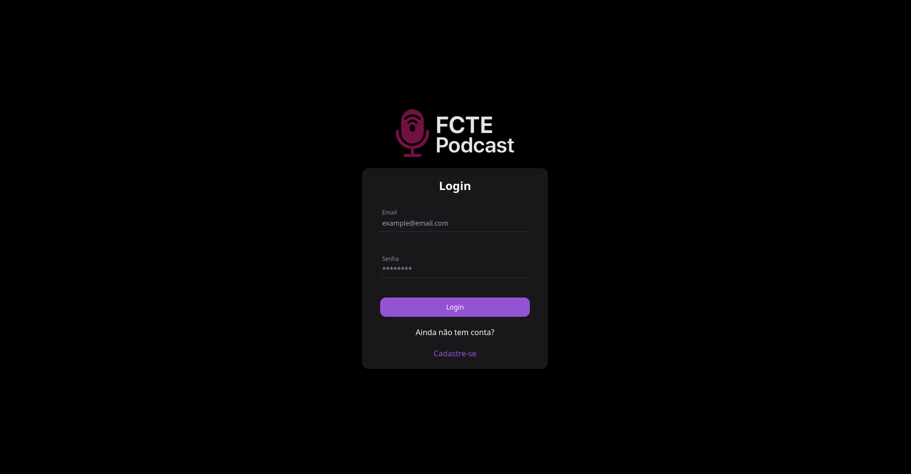

# 1.5. Iniciativas Extras (Base)

<!-- Breve relato sobre as Iniciativas Extras realizadas pela equipe, no escopo da entrega.

Apresentar links para comprobatórios que evidenciem qualquer que seja a realização extra conferida pela equipe no escopo da entrega. -->

## 🗣️ Identidade Verbal

Durante a fase de prototipagem da **Design Sprint**, optamos por desenvolver também a **identidade verbal** do sistema, reconhecendo sua importância tanto quanto a identidade visual. 

A identidade verbal é fundamental para garantir **clareza, reconhecimento e confiabilidade**, especialmente em um **contexto universitário**, onde a comunicação direta e profissional fortalece a imagem da plataforma.

### 🌐 Domínio oficial

Com o objetivo de facilitar o acesso e fortalecer a presença digital do projeto, adquirimos o domínio:

🔗 **[fctepodcast.site](https://fctepodcast.site)**

Esse endereço é curto, memorável e reforça a proposta do projeto, além de facilitar a divulgação entre os usuários.

### 📩 Canais de contato

Também configuramos canais de comunicação oficiais, garantindo suporte adequado aos usuários:

- 📬 **contato@fctepodcast.site** – Para dúvidas gerais, parcerias e sugestões.  
- 🛠️ **suporte@fctepodcast.site** – Para atendimento técnico e auxílio ao uso da plataforma.

## 🎨 Identidade Visual

Durante a **Design Sprint**, também definimos a **identidade visual** do projeto. Assim como a identidade verbal, buscamos um estilo **minimalista**, porém com **personalidade e consistência**, garantindo que o visual do sistema transmitisse profissionalismo e fosse facilmente reconhecível.

Optamos por uma paleta de cores que equilibra **simplicidade e impacto visual**, com tons que funcionam bem tanto no **modo claro** quanto no **modo escuro**, ampliando a acessibilidade e a estética em diferentes contextos de uso.

Essa padronização visual nos permite manter uma **comunicação coesa** em todas as telas, mídias e materiais relacionados ao projeto.

## 🧱 Aplicação da Identidade Visual e Atomic Design

Mesmo sem a finalização completa do **backlog** e das **histórias de usuário**, ficamos bastante empolgados com o projeto. Por isso, decidimos implementar uma funcionalidade básica no sistema, com o objetivo de **visualizar na prática** como nossas ideias tomariam forma na interface.

Essa etapa inicial nos permitiu aplicar diretamente a **identidade visual** definida, além de testar a estrutura proposta pelo **Atomic Design** — uma abordagem que nos chamou bastante atenção e gerou entusiasmo entre os membros do grupo.

A aplicação prática dessas ideias foi essencial para validar o estilo visual e estrutural do sistema, além de trazer uma noção mais clara de como o design modular pode otimizar o desenvolvimento e a manutenção da interface.

**Acesse pelo link:**

🔗 **[fctepodcast.site/login](https://fctepodcast.site/login)**

---

#### Histórico de versões 

| Versão |    Data    |              Descrição              |       Autor(es)       |      Revisor(es)       |
|:------:|:----------:|:-----------------------------------:|:---------------------:|:----------------------:|
| 1.0    | 08/04/2025 | Criação do documento                | Gustavo Costa         | Harleny Angéllica      |
| 1.1    | 11/04/2025 | Adicionando Informações sobre o site              | Gustavo Costa         |    Harleny Angéllica     |